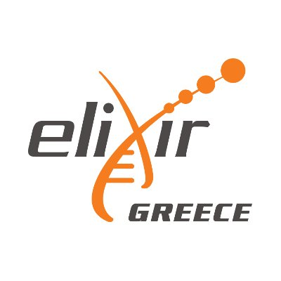

# ImpactAssessment

## BioData.pt Workshop: Assessing the Impact of Research Activities

Demonstrating impact is central to ensuring the long-term sustainability of research activities. Beyond performance, research projects are increasingly asked by relevant stakeholders, such as national & local authorities and funders, to measure and communicate their impact. 

In this sense and in the frame of the H2020 ELIXIR-CONVERGE Project and “Empowering ELIXIR Nodes to measure and communicate their performance and impact” Staff Exchange Scheme, BioData.pt organized, in collaboration with ELIXIR - Greece, a pilot of the BioData.pt Workshop: Assessing the Impact of Research Activities, intended to be refined and replicated as a capacity-building action within the Portuguese Node of ELIXIR and shared with the research community.

Assessing the Impact of Research Activities is a one-day workshop aiming to help researchers assessing the impact of their research activities. The workshop features two introductory lectures on scientific and socio-economic impact, followed by a hands-on impact assessment exercise where participants form groups to fill in a virtual Canvas for a mock project, and the showcase of an assessed activity.

Find out more about impact [**here**](http://impact.biodata.pt/index.html) and engage with us through our [**forum**](https://forum.biodata.pt).

---
### Authors/Organizers
* Ana Portugal Melo - author and organizer
* Daniel Faria - author
* Marta Silva - organizer
* Rafael Santos - author and organizer
* Thanasis Vergoulis - invited author

---
### Host

 
**Follow us:**&nbsp;&nbsp;&nbsp;&nbsp;&nbsp;&nbsp;

---
### Partners

---
### Funding

